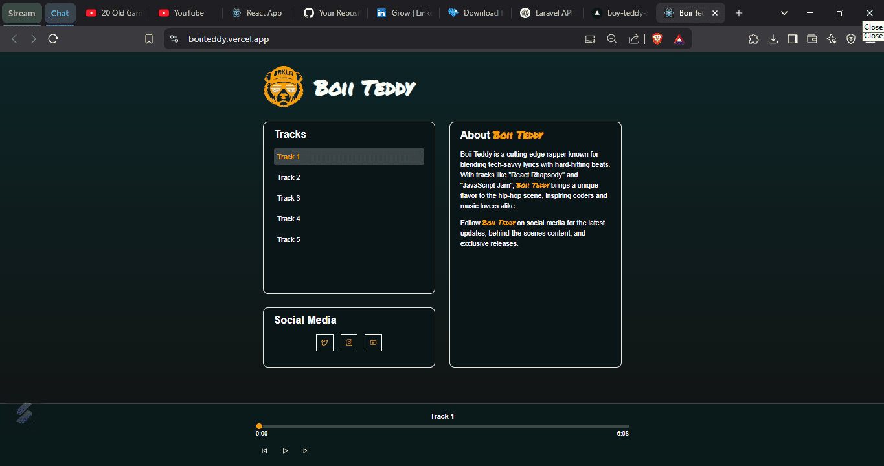

# Rapper Artist App

This is a music player web application for the artist **Boii Teddy**. It allows users to listen to various tracks, control playback, and visit the artist's social media profiles.

## Features
- Play, pause, skip forward, and skip backward tracks
- Preload adjacent tracks for a smoother listening experience
- Display track progress and loading status
- Error handling with format fallback support
- Social media links for artist promotion

## Screenshot


## Technologies Used
- **React.js**
- **ReactPlayer** for audio playback
- **Lucide-react** for icons
- **shadcn/ui** components
- **Tailwind CSS** for styling

## Prerequisites
Ensure you have the following installed before running the project:
- **Node.js** (Latest LTS version recommended)
- **npm** or **yarn**

## Setup Instructions

### 1. Clone the Repository
```sh
git clone https://github.com/Tshabalala-Thabo/boy-teddy-react.git
cd boy-teddy-react
```

### 2. Install Dependencies
Using npm:
```sh
npm install
```
Or using yarn:
```sh
yarn install
```

### 3. Start the Development Server
Using npm:
```sh
npm run dev
```
Or using yarn:
```sh
yarn dev
```

### 4. Open the Application
Visit `http://localhost:3000` in your browser to access the app.

## Deployment
To build the project for production:
```sh
npm run build
```
Then, deploy the contents of the `dist/` or `build/` directory to your preferred hosting service.

## Notes
- Ensure that the audio files (`/audio/*.mp3`) are correctly placed in the `public/audio` directory.
- Update the `artist` object in the code to modify song lists and social media links.

## License
This project is licensed under the MIT License.

